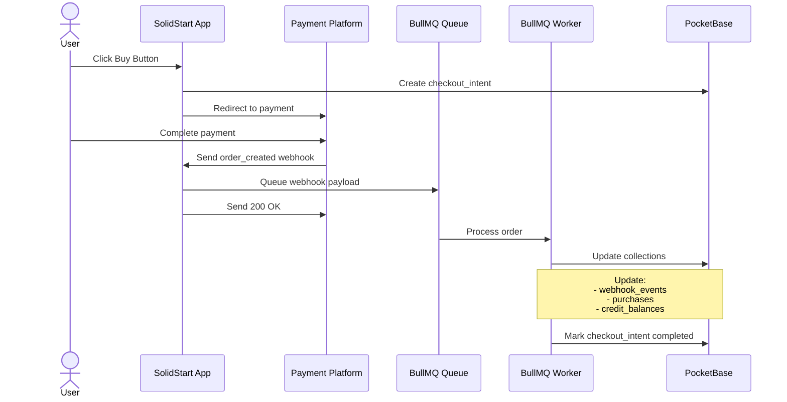
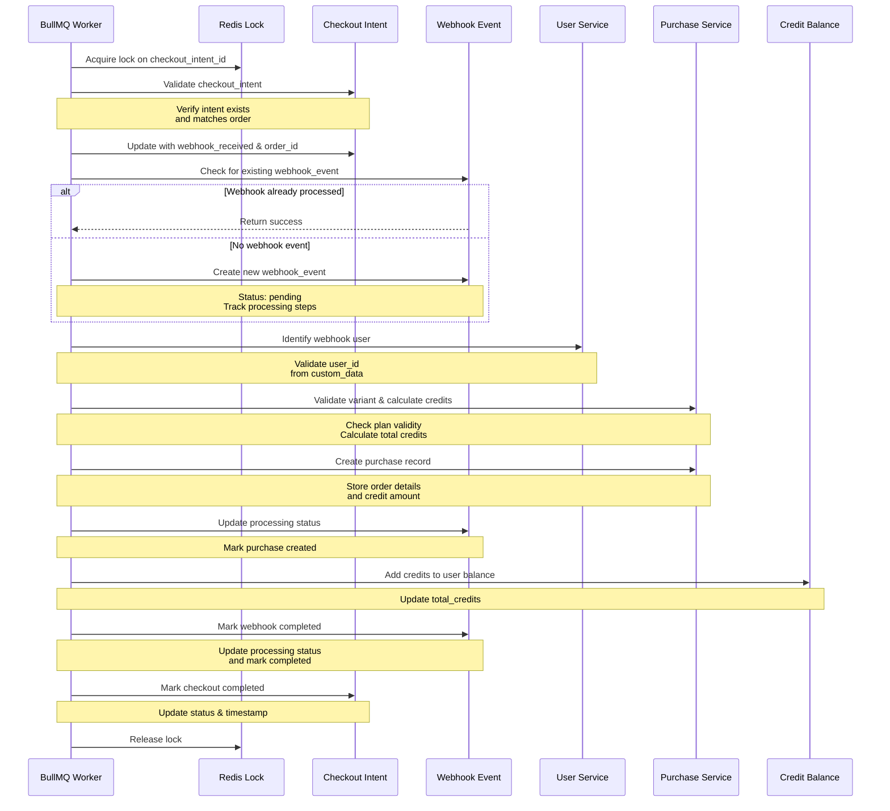
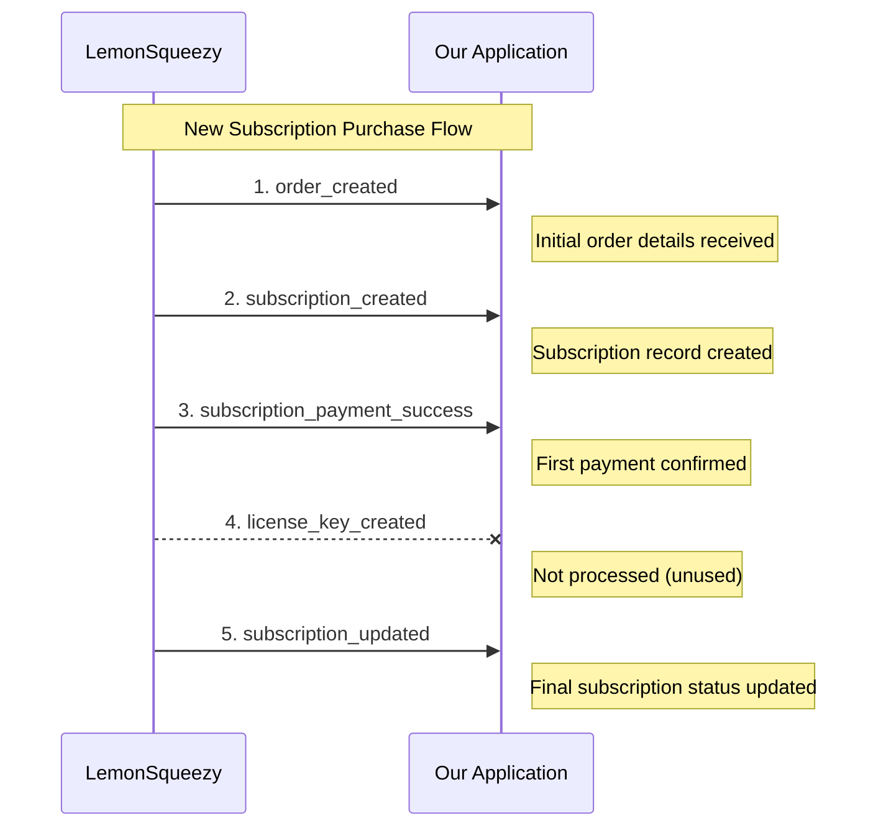
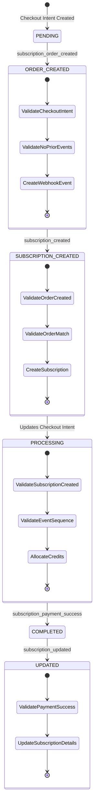
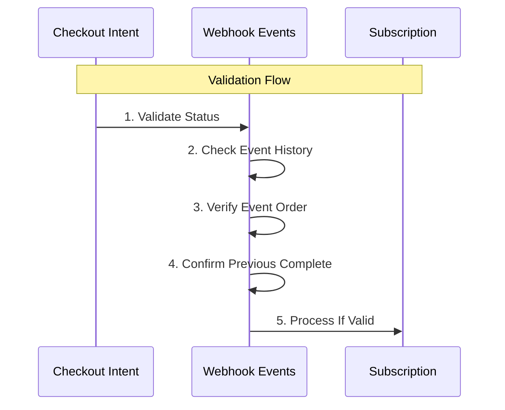
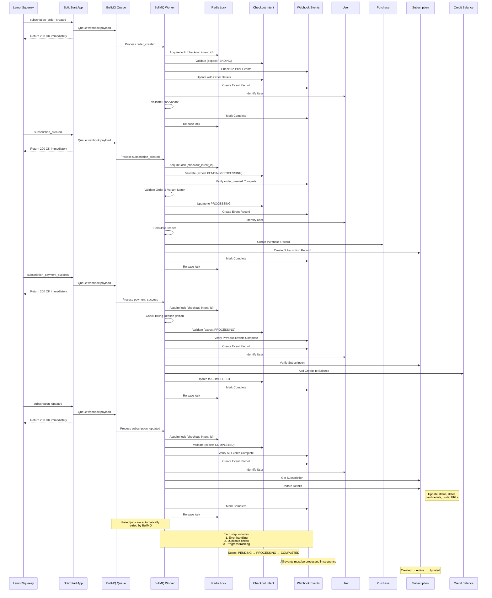

# Readme: LemonSqueezy Integration

## Pocketbase Collections

This platform relies on a few Pocketbase collections to track payment and credit usage:

- checkout_intents
- lq_webhook_events
- lq_purchases
- lq_subscriptions
- credit_balances

lq stands for LemonSqueezy, i.e these collections are payment platform specific. In the future, if we work on integrating with Paddle for example, we need to create Paddle specific equivalents for these collections (Example: pd_webhook_events, pd_purchases etc). `checkout_intents` and `credit_balances` are intended to be used as payment platform agnostic collections. `checkout_intents` get populated as soon as a user clicks the `Buy` or `Generate Now` button. We create a checkout_intents record and pass it on to the payment platform along with the respective userId. All subsequent payment webhook payloads have both these fields for us to reconcile. Below are the details of these collections and their relations:

Github somehow does not like mermaid ER Diagrams. So, attached it as a png file (the empty box on the left is users collection)

## Payment

### One off purchase

The below collections are used to track one off purchases:

- checkout_intents
- lq_webhook_events
- lq_purchases
- credit_balances

Below is the detailed workflow, this is subjected to change over time. This detailed workflow should be used as a guide only. We should always check the source of truth, which is the code.

### Subscription (New subscription only)

The below collections are used to track various stages of subscription:

- checkout_intents
- lq_webhook_events
- lq_purchases
- lq_subscriptions
- credit_balances

Unlike oneoff purchases, LemonSqueezy sends 4 webhook events, generally in the below order (the order is not guranteed) for a new subscription:

Each webhook event serves a specific purpose:

1. `order_created`: Contains the initial order information and payment details
2. `subscription_created`: Notifies that a subscription has been created for the order
3. `subscription_payment_success`: Confirms successful processing of the first payment
4. `license_key_created`: Notifies that a license key has been created (unused in this context)
5. `subscription_updated`: Updates the subscription with final status and details

Note: The `license_key_created` event is also sent by LemonSqueezy but is not processed by our application as we don't use license functionality for subscriptions.

The application enforces webhook processing order through strict validation checks and lock on checkout_intent_id:

Below are the detailed processing steps:

